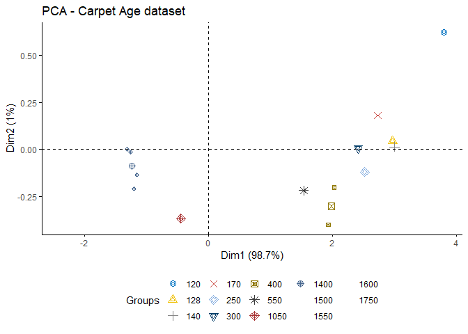
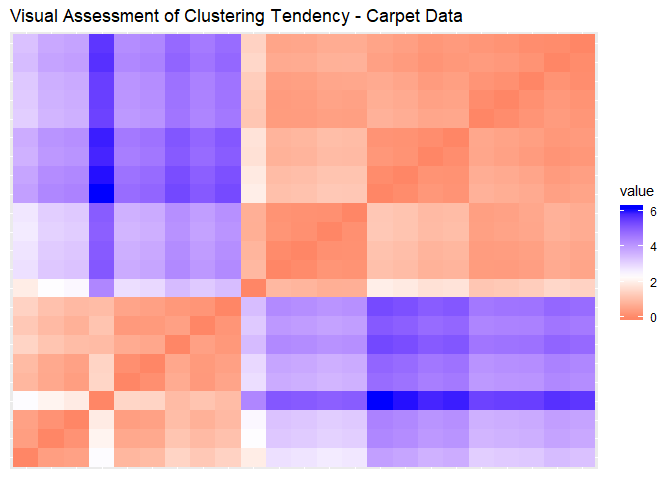
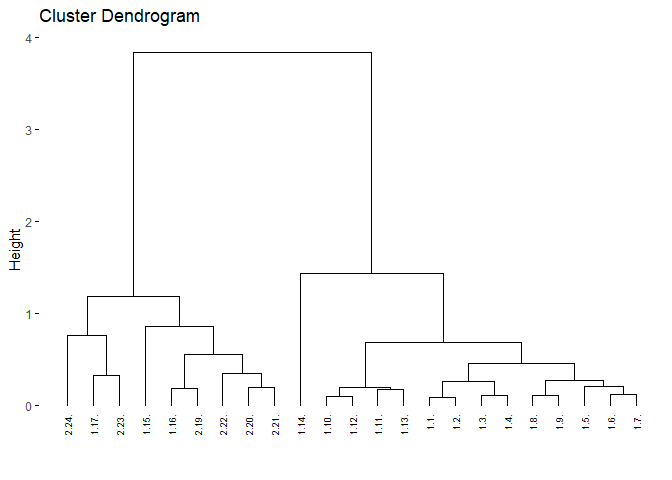
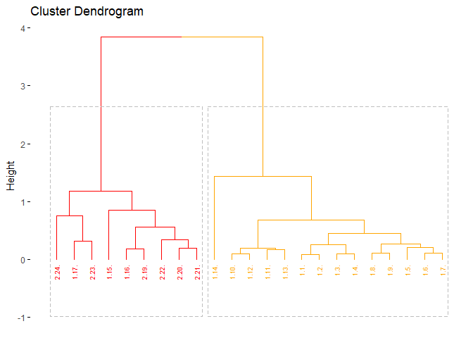

Dataset: 	
Determination of Age of Old Carpets by Chemical Levels

Source: 
carpet_age.csv
http://users.stat.ufl.edu/~winner/datasets.html

Description: 
Age of 23 Old Carpet and Wool samples, and Cysteic Acid, Cystine, Methionine, and Tyrosine. 

Variable Names:
Sample ID : sample_id
Age : age
Cysteic Acid Level: cys_acid
cystine level: cys
Methionine Level: met
Tyrosine Level: tyr


OBJECTIVE: Form groupings of different carpets using hierarchical clustering algorithm.


Load the required libraries:


```r
library(factoextra)
```

```
## Loading required package: ggplot2
```

```
## Welcome! Want to learn more? See two factoextra-related books at https://goo.gl/ve3WBa
```

```r
library(clustertend)
library(NbClust)
library(fpc)
```

```
## Warning: package 'fpc' was built under R version 3.6.3
```

```r
library(tidyverse)
```

```
## -- Attaching packages ------------------------------------------------------------------------------------------------------- tidyverse 1.3.0 --
```

```
## v tibble  2.1.3     v dplyr   0.8.4
## v tidyr   1.0.2     v stringr 1.4.0
## v readr   1.3.1     v forcats 0.5.0
## v purrr   0.3.3
```

```
## Warning: package 'forcats' was built under R version 3.6.3
```

```
## -- Conflicts ---------------------------------------------------------------------------------------------------------- tidyverse_conflicts() --
## x dplyr::filter() masks stats::filter()
## x dplyr::lag()    masks stats::lag()
```

```r
library(cluster)
library(clValid)
```

```
## Warning: package 'clValid' was built under R version 3.6.3
```


Set seed to ensure reproducibility:


```r
set.seed(1998)
```


Import the dataset:


```r
carpet <- read_csv("carpet_age.csv")
```

```
## Parsed with column specification:
## cols(
##   sample_id = col_character(),
##   age = col_double(),
##   cys_acid = col_double(),
##   cys = col_double(),
##   met = col_double(),
##   tyr = col_double()
## )
```

```r
carpet
```

```
## # A tibble: 25 x 6
##    sample_id   age cys_acid   cys   met   tyr
##    <chr>     <dbl>    <dbl> <dbl> <dbl> <dbl>
##  1 1.1.       1750     4.39  0.97  0     0   
##  2 1.2.       1600     4.3   1.03  0     0   
##  3 1.3.       1600     4.27  1.21  0.02  0.15
##  4 1.4.       1600     4.33  1.1   0.02  0.2 
##  5 1.5.       1600     4.01  1.19  0.01  0.2 
##  6 1.6.       1550     3.99  1.22  0.03  0.3 
##  7 1.7.       1550     3.97  1.33  0.03  0.38
##  8 1.8.       1550     3.82  1.19  0.02  0.54
##  9 1.9.       1500     3.93  1.22  0.03  0.53
## 10 1.10.      1400     3.81  1.53  0.03  0.75
## # ... with 15 more rows
```


Check structure:


```r
str(carpet)
```

```
## Classes 'spec_tbl_df', 'tbl_df', 'tbl' and 'data.frame':	25 obs. of  6 variables:
##  $ sample_id: chr  "1.1." "1.2." "1.3." "1.4." ...
##  $ age      : num  1750 1600 1600 1600 1600 1550 1550 1550 1500 1400 ...
##  $ cys_acid : num  4.39 4.3 4.27 4.33 4.01 3.99 3.97 3.82 3.93 3.81 ...
##  $ cys      : num  0.97 1.03 1.21 1.1 1.19 1.22 1.33 1.19 1.22 1.53 ...
##  $ met      : num  0 0 0.02 0.02 0.01 0.03 0.03 0.02 0.03 0.03 ...
##  $ tyr      : num  0 0 0.15 0.2 0.2 0.3 0.38 0.54 0.53 0.75 ...
##  - attr(*, "spec")=
##   .. cols(
##   ..   sample_id = col_character(),
##   ..   age = col_double(),
##   ..   cys_acid = col_double(),
##   ..   cys = col_double(),
##   ..   met = col_double(),
##   ..   tyr = col_double()
##   .. )
```


```r
summary(carpet)
```

```
##   sample_id              age          cys_acid          cys       
##  Length:25          Min.   : 120   Min.   :0.880   Min.   :0.970  
##  Class :character   1st Qu.: 350   1st Qu.:1.440   1st Qu.:1.220  
##  Mode  :character   Median :1400   Median :3.540   Median :1.540  
##                     Mean   :1018   Mean   :2.798   Mean   :2.422  
##                     3rd Qu.:1550   3rd Qu.:3.970   3rd Qu.:3.790  
##                     Max.   :1750   Max.   :4.390   Max.   :5.190  
##                     NA's   :2                                     
##       met              tyr      
##  Min.   :0.0000   Min.   :0.00  
##  1st Qu.:0.0300   1st Qu.:0.38  
##  Median :0.0500   Median :0.89  
##  Mean   :0.1564   Mean   :1.33  
##  3rd Qu.:0.2900   3rd Qu.:2.32  
##  Max.   :0.4000   Max.   :2.85  
## 
```

We can see that there are 2 observations with missing age.


```r
colSums(is.na(carpet))
```

```
## sample_id       age  cys_acid       cys       met       tyr 
##         0         2         0         0         0         0
```

The 2 observations with missing age value will be removed as this is less than 10% of our data. We will proceed with scaling after removing these observations.


```r
carpet <- carpet %>%
  drop_na()
```

Let's check the df for missing values:


```r
summary(carpet)
```

```
##   sample_id              age          cys_acid          cys       
##  Length:23          Min.   : 120   Min.   :0.880   Min.   :0.970  
##  Class :character   1st Qu.: 350   1st Qu.:1.405   1st Qu.:1.215  
##  Mode  :character   Median :1400   Median :3.650   Median :1.530  
##                     Mean   :1018   Mean   :2.895   Mean   :2.321  
##                     3rd Qu.:1550   3rd Qu.:3.980   3rd Qu.:3.610  
##                     Max.   :1750   Max.   :4.390   Max.   :5.190  
##       met              tyr       
##  Min.   :0.0000   Min.   :0.000  
##  1st Qu.:0.0250   1st Qu.:0.340  
##  Median :0.0400   Median :0.770  
##  Mean   :0.1448   Mean   :1.255  
##  3rd Qu.:0.2850   3rd Qu.:2.315  
##  Max.   :0.4000   Max.   :2.850
```


```r
colSums(is.na(carpet))
```

```
## sample_id       age  cys_acid       cys       met       tyr 
##         0         0         0         0         0         0
```

We'll proceed to scale the data:


```r
str(carpet)
```

```
## Classes 'tbl_df', 'tbl' and 'data.frame':	23 obs. of  6 variables:
##  $ sample_id: chr  "1.1." "1.2." "1.3." "1.4." ...
##  $ age      : num  1750 1600 1600 1600 1600 1550 1550 1550 1500 1400 ...
##  $ cys_acid : num  4.39 4.3 4.27 4.33 4.01 3.99 3.97 3.82 3.93 3.81 ...
##  $ cys      : num  0.97 1.03 1.21 1.1 1.19 1.22 1.33 1.19 1.22 1.53 ...
##  $ met      : num  0 0 0.02 0.02 0.01 0.03 0.03 0.02 0.03 0.03 ...
##  $ tyr      : num  0 0 0.15 0.2 0.2 0.3 0.38 0.54 0.53 0.75 ...
```

```r
head(carpet)
```

```
## # A tibble: 6 x 6
##   sample_id   age cys_acid   cys   met   tyr
##   <chr>     <dbl>    <dbl> <dbl> <dbl> <dbl>
## 1 1.1.       1750     4.39  0.97  0     0   
## 2 1.2.       1600     4.3   1.03  0     0   
## 3 1.3.       1600     4.27  1.21  0.02  0.15
## 4 1.4.       1600     4.33  1.1   0.02  0.2 
## 5 1.5.       1600     4.01  1.19  0.01  0.2 
## 6 1.6.       1550     3.99  1.22  0.03  0.3
```

```r
carpet_df <- data.frame(carpet, row.names=1) #use sample_id column as rownames
carpet_scaled <- carpet_df %>%
    select(-age)%>% #all columns except age
    scale()
carpet_scaled
```

```
##         cys_acid        cys         met         tyr
## 1.1.   1.1127835 -0.9894801 -0.96818132 -1.20944886
## 1.2.   1.0457834 -0.9455457 -0.96818132 -1.20944886
## 1.3.   1.0234501 -0.8137424 -0.83443856 -1.06491825
## 1.4.   1.0681168 -0.8942888 -0.83443856 -1.01674138
## 1.5.   0.8298944 -0.8283872 -0.90130994 -1.01674138
## 1.6.   0.8150055 -0.8064199 -0.76756717 -0.92038765
## 1.7.   0.8001166 -0.7258735 -0.76756717 -0.84330466
## 1.8.   0.6884498 -0.8283872 -0.83443856 -0.68913868
## 1.9.   0.7703388 -0.8064199 -0.76756717 -0.69877405
## 1.10.  0.6810054 -0.5794253 -0.76756717 -0.48679583
## 1.11.  0.4800052 -0.6013925 -0.70069579 -0.46752509
## 1.12.  0.6140053 -0.5721029 -0.70069579 -0.50606658
## 1.13.  0.5618942 -0.6526494 -0.63382441 -0.35190060
## 1.14.  0.1673383 -0.3963651  0.03488942  0.07205584
## 1.15. -0.7632180  0.5848375  0.43611771  0.82361498
## 1.16. -1.0461071  0.6507392  0.90421739  1.02595783
## 2.19. -1.0163293  0.8118322  0.83734601  0.99705171
## 2.20. -1.1726628  1.0974061  1.10483154  1.01632245
## 2.21. -1.2545517  1.0754388  0.97108877  1.13194694
## 2.22. -1.2694406  1.3390455  1.23857431  1.07413470
## 1.17. -1.2471073  1.4049472  1.57293122  1.53663263
## 2.23. -1.3885518  1.3756576  1.70667398  1.28611292
## 2.24. -1.5002186  2.1005759  1.63980260  1.51736188
## attr(,"scaled:center")
##  cys_acid       cys       met       tyr 
## 2.8952174 2.3213043 0.1447826 1.2552174 
## attr(,"scaled:scale")
##  cys_acid       cys       met       tyr 
## 1.3432825 1.3656710 0.1495408 1.0378425
```

Hierarchical clustering is suitable for small datasets and outputs a dendrogram that provides a good visualization of the clusters.
Before we proceed, let's check for clustering tendency in our dataset.This will ensure that our clustering exercise provides meaningful groupings instead of merely random structures. It is worth noting that clustering algorithms always return clusters, whether or not the data actually contains meaningful clusters.

Visual Inspection of the data:


```r
fviz_pca_ind(prcomp(carpet_df[,-1]), title="PCA - Carpet Age dataset",
  habillage=carpet_df$age, palette="jco",
  geom="point", ggtheme= theme_classic(),
  legend="bottom")
```

```
## Warning: This manual palette can handle a maximum of 10 values. You have
## supplied 14.
```

```
## Warning: Removed 9 rows containing missing values (geom_point).
```

```
## Warning: Removed 4 rows containing missing values (geom_point).
```

<!-- -->

From the plot, it appears that there are 2 clusters in our dataset.

To properly evaluate the feasibility of cluster analysis on the data set, we'll proceed with the statistical method for assessing clustering tendency. This method uses the Hopkins statistic. Using a threshold of 0.5, we conclude that the dataset is clusterable if the Hopkins stat is > 0.5.


```r
res_hop <- get_clust_tendency(carpet_df[,-1], n = nrow(carpet_df[,-1])-1, graph=FALSE)
res_hop$hopkins_stat
```

```
## [1] 0.8575146
```

The hopkins statistic is 0.839 which indicates that our data is highly clusterable.

Another way of assessing clustering tendency is using the visual assessment of cluster tendency (VAT):


```r
fviz_dist(dist(carpet_df[,-1]), show_labels=FALSE) +
  labs(title="Visual Assessment of Clustering Tendency - Carpet Data")
```

<!-- -->

The red blocks indicate high similarity. Here we look at the square shapes around the diagonal. This plot confirms that there are clusters in the data.


We'll proceed with the hierarchical clustering.

Let's compute the dissimilarity matrix using the euclidean distance:


```r
carpet_dist <- dist(carpet_scaled, method = "euclidean")
as.matrix(carpet_dist)[1:5,1:5] #display first 5 rows of distance matrix
```

```
##            1.1.       1.2.      1.3.      1.4.      1.5.
## 1.1. 0.00000000 0.08012018 0.2786404 0.2570599 0.3841681
## 1.2. 0.08012018 0.00000000 0.2380066 0.2411417 0.3192838
## 1.3. 0.27864036 0.23800656 0.0000000 0.1039416 0.2108817
## 1.4. 0.25705991 0.24114174 0.1039416 0.0000000 0.2560561
## 1.5. 0.38416812 0.31928382 0.2108817 0.2560561 0.0000000
```

We can now use the distance matrix as input to our hclust function:


```r
carpet_hc <- hclust(carpet_dist, method = "average")
fviz_dend(carpet_hc, cex = 0.5) #visualize the dendrogram
```

<!-- -->


We will verify how well our cluster tree reflects our data by computing the cophenetic distance. Next, we compute the correlation between the original distance matrix and the cophenetic distance. Here we are looking at correlation values > 0.75 to indicate that the clustering accurately reflects the groupings in the data. Generally, the average linkage method yields high values of this correlation which is why we used it to perform our clustering.


```r
coph_carpet <- cophenetic(carpet_hc) #compute cophenetic dist
cor(carpet_dist, coph_carpet) #correlation bet orig dist matrix and the cophenetic dist
```

```
## [1] 0.9411499
```

The correlation of 0.935 confirms that the dendrogram produced by the hierarchical clustering with average linkage is an accurate representation of the data.

Let's cut the dendrogram into k=2 groups:


```r
fviz_dend(carpet_hc, k =2,
          cex=0.5,
          k_colors=c("red", "orange"),
          color_labels_by_k = TRUE,
          rect = TRUE,
          )
```

<!-- -->

