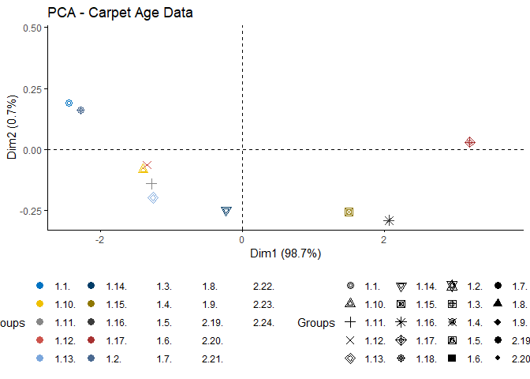
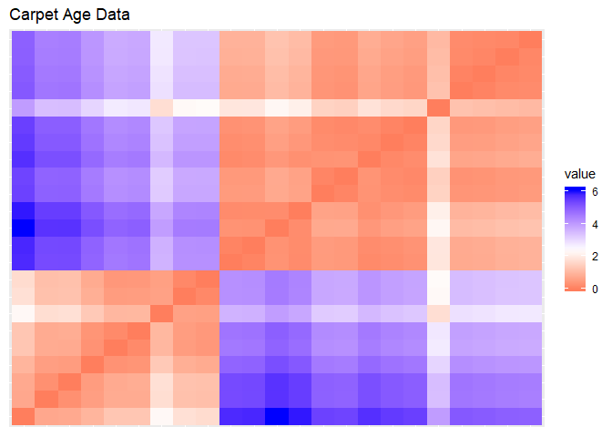
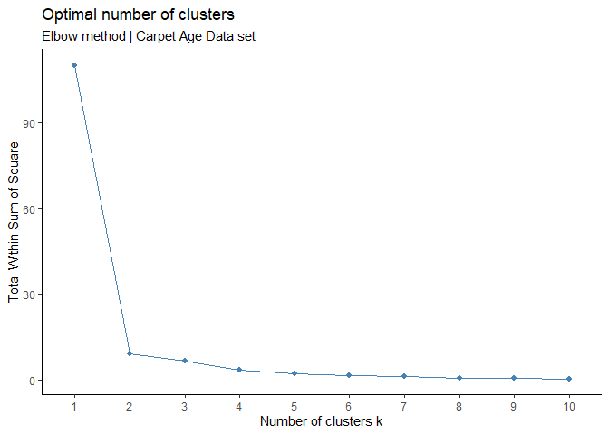
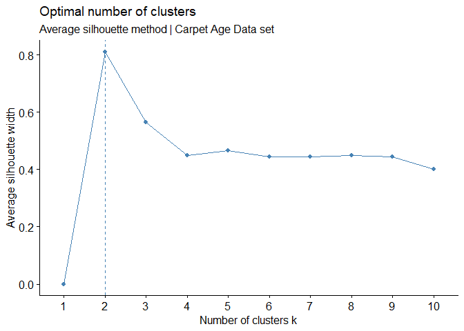
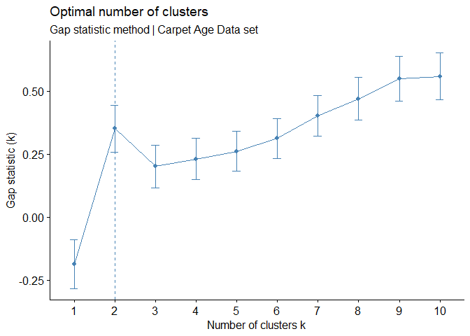
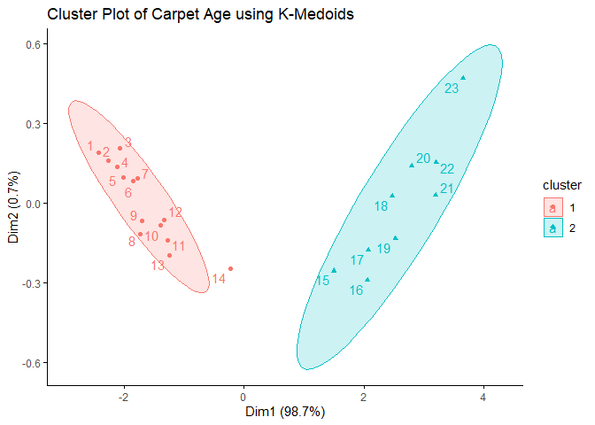
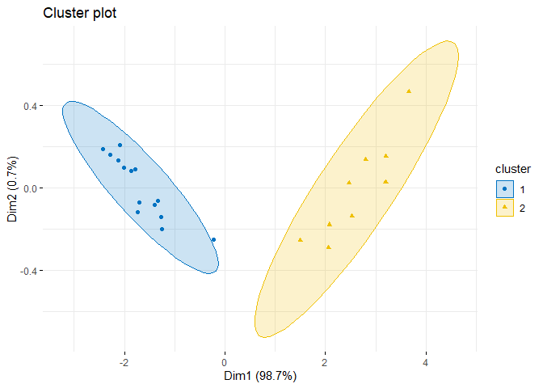
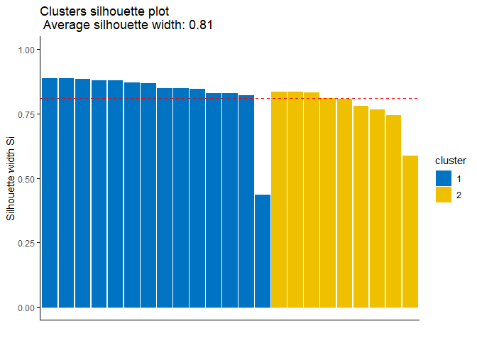

Application of K-Medoids Partitioning to Antique Carpets Dataset
================
Abie A
31/05/2020

Objective: apply K-medoids - PAM to carpet age dataset

Let’s load the required libraries.

``` r
library(factoextra)
```

    ## Loading required package: ggplot2

    ## Welcome! Want to learn more? See two factoextra-related books at https://goo.gl/ve3WBa

``` r
library(clustertend)
library(NbClust)
library(fpc)
```

    ## Warning: package 'fpc' was built under R version 3.6.3

``` r
library(dplyr)
```

    ## 
    ## Attaching package: 'dplyr'

    ## The following objects are masked from 'package:stats':
    ## 
    ##     filter, lag

    ## The following objects are masked from 'package:base':
    ## 
    ##     intersect, setdiff, setequal, union

``` r
library(cluster)
library(clValid)
```

    ## Warning: package 'clValid' was built under R version 3.6.3

Set seed to ensure reproducibility:

``` r
set.seed(1998) #for reproducibility
```

Next we’ll import the data:

``` r
carpet_df <- read.csv("carpet_age.csv")
str(carpet_df)
```

    ## 'data.frame':    25 obs. of  6 variables:
    ##  $ sample_id: Factor w/ 25 levels "1.1.","1.10.",..: 1 11 12 13 14 15 16 17 18 2 ...
    ##  $ age      : int  1750 1600 1600 1600 1600 1550 1550 1550 1500 1400 ...
    ##  $ cys_acid : num  4.39 4.3 4.27 4.33 4.01 3.99 3.97 3.82 3.93 3.81 ...
    ##  $ cys      : num  0.97 1.03 1.21 1.1 1.19 1.22 1.33 1.19 1.22 1.53 ...
    ##  $ met      : num  0 0 0.02 0.02 0.01 0.03 0.03 0.02 0.03 0.03 ...
    ##  $ tyr      : num  0 0 0.15 0.2 0.2 0.3 0.38 0.54 0.53 0.75 ...

``` r
head(carpet_df)
```

    ##   sample_id  age cys_acid  cys  met  tyr
    ## 1      1.1. 1750     4.39 0.97 0.00 0.00
    ## 2      1.2. 1600     4.30 1.03 0.00 0.00
    ## 3      1.3. 1600     4.27 1.21 0.02 0.15
    ## 4      1.4. 1600     4.33 1.10 0.02 0.20
    ## 5      1.5. 1600     4.01 1.19 0.01 0.20
    ## 6      1.6. 1550     3.99 1.22 0.03 0.30

PRE-WORK | DATA CLEANSING, SCALE, ETC

Check for missing data:

``` r
apply(is.na(carpet_df), 2, sum)
```

    ## sample_id       age  cys_acid       cys       met       tyr 
    ##         0         2         0         0         0         0

There are 2 observations with missing data for age, this is less than
10% of our data so we will remove the records and proceed to scale.

``` r
carpet_df <- carpet_df[!(is.na(carpet_df$age)),] #delete rows where age = NA
apply(is.na(carpet_df),2,sum) #confirm that there are no missing data left
```

    ## sample_id       age  cys_acid       cys       met       tyr 
    ##         0         0         0         0         0         0

``` r
carpet.scaled <- scale(carpet_df[,-1])

head(carpet.scaled)
```

    ##         age  cys_acid        cys        met        tyr
    ## 1 1.1622026 1.1127835 -0.9894801 -0.9681813 -1.2094489
    ## 2 0.9241312 1.0457834 -0.9455457 -0.9681813 -1.2094489
    ## 3 0.9241312 1.0234501 -0.8137424 -0.8344386 -1.0649183
    ## 4 0.9241312 1.0681168 -0.8942888 -0.8344386 -1.0167414
    ## 5 0.9241312 0.8298944 -0.8283872 -0.9013099 -1.0167414
    ## 6 0.8447740 0.8150055 -0.8064199 -0.7675672 -0.9203876

Step 1: Assess Clustering Tendency

``` r
par(mfrow = c(2,2))
```

Visualize data to assess for cluster tendency. Plot data set, we need to
do pca first because we have \> 2 vars.

``` r
fviz_pca_ind(prcomp(carpet.scaled), title = "PCA - Carpet Age Data",
             habillage = carpet_df$sample_id,palette = "jco",
             geom = "point", ggtheme = theme_classic(),
             legend = "bottom")
```

    ## Warning: This manual palette can handle a maximum of 10 values. You have
    ## supplied 23.

    ## Warning: Removed 13 rows containing missing values (geom_point).
    
    ## Warning: Removed 13 rows containing missing values (geom_point).

<!-- -->

Statistical method of assessing clustering tendency

We can conduct the Hopkins Statistic test iteratively, using 0.5 as the
threshold to reject the alternative hypothesis. That is, if H \< 0.5,
then it is unlikely that D has statistically significant clusters. If
the value of Hopkins statistic is close to 1, then we can reject the
null hypothesis and conclude that the dataset D is significantly a
clusterable data.

Using get\_clust\_tendency, we can conclude that the data is highly
clusterable if value is near to 1:

``` r
res <- get_clust_tendency(carpet.scaled, n = nrow(carpet.scaled)-1, graph = FALSE)
res$hopkins_stat
```

    ## [1] 0.8489494

Hopkins stat using get\_clust\_tendency is 0.8489 so we can conclude
that it is highly clusterable.

Another method is using hopkins() function \[in clustertend package\].
It implements 1- the definition of H.

Let’s apply the visual method of assessing clustering tendency:

``` r
fviz_dist(dist(carpet.scaled), show_labels = FALSE)+
  labs(title = "Carpet Age Data")
```

<!-- -->

Here we are checking for big squares along the 45 degree line to be able
to say that the data is clusterable. The dissimilarity visualization
above supports the hopkins finding that the carpet data contains cluster
structures.

STEP 2: DETERMINE OPTIMAL No. OF CLUSTERS

Direct Methods: Elbow and silhouette methods

Elbow method | The location of a bend (knee) in the plot is generally
considered as an indicator of the appropriate number of clusters; The
Elbow method looks at the total WSS as a function of the number of
clusters: One should choose a number of clusters so that adding another
cluster doesn’t improve much better the total WSS.

``` r
fviz_nbclust(carpet.scaled, cluster::pam, method = "wss")+
   labs(subtitle = "Elbow method | Carpet Age Data set") +
  theme_classic()+
  geom_vline(xintercept = 2, linetype = 2)
```

<!-- -->

The elbow method finds k=2 clusters as optimal.

Average Silhouette method | measures the quality of a clustering. That
is, it determines how well each object lies within its cluster. A high
average silhouette width indicates a good clustering. Average silhouette
method computes the average silhouette of observations for different
values of k. The optimal number of clusters k is the one that maximize
the average silhouette over a range of possible values for k (Kaufman
and Rousseeuw, 1990). The location of the maximum is considered as the
appropriate number of clusters.

``` r
fviz_nbclust(carpet.scaled, pam, method = "silhouette") +
 labs(subtitle = "Average silhouette method | Carpet Age Data set")
```

<!-- -->

The silhouette method finds k=2 as optimal.

Statistical Method: Gap stat

The gap statistic compares the total within intra-cluster variation for
different values of k with their expected values under null reference
distribution of the data.

``` r
fviz_nbclust(carpet.scaled, cluster::pam, method = "gap_stat", nboot = 500)+
  labs(subtitle = "Gap statistic method | Carpet Age Data set")
```

<!-- -->

The gap stat finds k=2 as optimal.

Our checks indicate that K=2 is the optimal number of clusters for
K-Medoids.

STEP 3: PARTITIONING CLUSTERING

pam has 2 options for metric:manhattan and euclidean K-medoids: less
prone to outliers

LEt’s run pam using the manhanttan distance:

``` r
pam.res <- pam(carpet.scaled, 2, metric = "manhattan", stand = FALSE)

pam.res$clusinfo
```

    ##      size max_diss   av_diss diameter separation
    ## [1,]   14 3.300556 0.9343782 4.934136   3.858118
    ## [2,]    9 2.531261 1.2315856 4.832642   3.858118

Now, let’s try using the euclidean distance:

``` r
pam.res2 <- pam(carpet.scaled, 2, metric = "euclidean", stand = FALSE)

pam.res2$clusinfo
```

    ##      size max_diss   av_diss diameter separation
    ## [1,]   14 1.618815 0.4609367 2.264592   1.784454
    ## [2,]    9 1.316242 0.6124075 2.288349   1.784454

We can see that PAM using Euclidean or manhattan distance both resulted
in clusters of size 14 and 9. However, PAM using manhattan distance
resulted in clusters that are more separated which is more desirable.

Let’s add the cluster information to original df:

``` r
carpet_cluster2 <- cbind(carpet_df, cluster = pam.res2$cluster)
head(carpet_cluster2)
```

    ##   sample_id  age cys_acid  cys  met  tyr cluster
    ## 1      1.1. 1750     4.39 0.97 0.00 0.00       1
    ## 2      1.2. 1600     4.30 1.03 0.00 0.00       1
    ## 3      1.3. 1600     4.27 1.21 0.02 0.15       1
    ## 4      1.4. 1600     4.33 1.10 0.02 0.20       1
    ## 5      1.5. 1600     4.01 1.19 0.01 0.20       1
    ## 6      1.6. 1550     3.99 1.22 0.03 0.30       1

We will proceed with pam using manhattan as the manhattan distance is
less prone to outliers

Let’s display the cluster medoids:

``` r
pam.res$medoids
```

    ##           age   cys_acid        cys        met        tyr
    ## 9   0.7654169  0.7703388 -0.8064199 -0.7675672 -0.6987741
    ## 19 -1.2185117 -1.2545517  1.0754388  0.9710888  1.1319469

Cluster numbers:

``` r
pam.res$clustering
```

    ##  1  2  3  4  5  6  7  8  9 10 11 12 13 14 15 16 17 18 19 20 21 22 23 
    ##  1  1  1  1  1  1  1  1  1  1  1  1  1  1  2  2  2  2  2  2  2  2  2

Visualize pam:

``` r
fviz_cluster(pam.res,
             #palette = c("#00AFBB", "#FC4E07"), # color palette
             ellipse.type = "t", # Concentration ellipse
             repel = TRUE, # Avoid label overplotting (slow)
             ggtheme = theme_classic(),
             main = "Cluster Plot of Carpet Age using K-Medoids"
             
)
```

<!-- -->

``` r
pam2.res <- carpet_df %>%
  mutate(cluster = pam.res$clustering) %>%
  group_by(cluster) %>%
  do(the_summary = summary(.))
pam2.res$the_summary
```

    ## [[1]]
    ##    sample_id      age          cys_acid          cys             met         
    ##  1.1.   :1   Min.   :1050   Min.   :3.120   Min.   :0.970   Min.   :0.00000  
    ##  1.10.  :1   1st Qu.:1400   1st Qu.:3.743   1st Qu.:1.190   1st Qu.:0.02000  
    ##  1.11.  :1   Median :1550   Median :3.950   Median :1.220   Median :0.03000  
    ##  1.12.  :1   Mean   :1496   Mean   :3.918   Mean   :1.303   Mean   :0.03357  
    ##  1.13.  :1   3rd Qu.:1600   3rd Qu.:4.205   3rd Qu.:1.482   3rd Qu.:0.03750  
    ##  1.14.  :1   Max.   :1750   Max.   :4.390   Max.   :1.780   Max.   :0.15000  
    ##  (Other):8                                                                   
    ##       tyr            cluster 
    ##  Min.   :0.0000   Min.   :1  
    ##  1st Qu.:0.2000   1st Qu.:1  
    ##  Median :0.4550   Median :1  
    ##  Mean   :0.4836   Mean   :1  
    ##  3rd Qu.:0.7450   3rd Qu.:1  
    ##  Max.   :1.3300   Max.   :1  
    ##                              
    ## 
    ## [[2]]
    ##    sample_id      age           cys_acid          cys             met        
    ##  1.15.  :1   Min.   :120.0   Min.   :0.880   Min.   :3.120   Min.   :0.2100  
    ##  1.16.  :1   1st Qu.:140.0   1st Qu.:1.190   1st Qu.:3.430   1st Qu.:0.2800  
    ##  1.17.  :1   Median :250.0   Median :1.220   Median :3.820   Median :0.3100  
    ##  2.19.  :1   Mean   :273.1   Mean   :1.304   Mean   :3.906   Mean   :0.3178  
    ##  2.20.  :1   3rd Qu.:400.0   3rd Qu.:1.490   3rd Qu.:4.200   3rd Qu.:0.3800  
    ##  2.21.  :1   Max.   :550.0   Max.   :1.870   Max.   :5.190   Max.   :0.4000  
    ##  (Other):3                                                                   
    ##       tyr           cluster 
    ##  Min.   :2.110   Min.   :2  
    ##  1st Qu.:2.310   1st Qu.:2  
    ##  Median :2.370   Median :2  
    ##  Mean   :2.456   Mean   :2  
    ##  3rd Qu.:2.590   3rd Qu.:2  
    ##  Max.   :2.850   Max.   :2  
    ## 

STEP 4: CLUSTER VALIDATION

Internal validation measures reflect often the compactness, the
connectedness and the separation of the cluster partitions.

Silhouette coefficient

The silhouette analysis measures how well an observation is clustered
and it estimates the average distance between clusters. The silhouette
plot displays a measure of how close each point in one cluster is to
points in the neighboring clusters.

If Si (silhouette coefficient) is almost 1, well clustered. If Si is
near 0, the observation may lie between 2 clusters. If Si negative,
there is a possibility that the observation is placed in the wrong
cluster. Observations with a large Si (almost 1) are very well
clustered.

We will use eclust() to perform pam and then plug it into
fvz\_silhouette:

``` r
pamres.eclust <- eclust(carpet.scaled, "pam", k = 2, graph = FALSE)
```

Visualize k-medoidsclusters

``` r
fviz_cluster(pamres.eclust, geom = "point", ellipse.type = "norm",
             palette = "jco", ggtheme = theme_minimal())
```

<!-- -->

Generate the silhouette plot:

``` r
fviz_silhouette(pamres.eclust, palette = "jco",
                ggtheme = theme_classic())
```

    ##   cluster size ave.sil.width
    ## 1       1   14          0.83
    ## 2       2    9          0.78

<!-- -->

The average silhouette width = 0.81.

We shld look for observations with -ve silhouette index as this would
indicate that the observation is in the wrong cluster Visually, there
appears to be no observations with -ve silhouette coeff. Let’s verify
that.We can find the name of these samples and determine the clusters
they are closer (neighbor cluster).

Silhouette width of observation:

``` r
sil <- pamres.eclust$silinfo$widths[, 1:3]
```

Objects with negative silhouette

``` r
neg_sil_index <- which(sil[, 'sil_width'] < 0)
sil[neg_sil_index, , drop = FALSE]
```

    ## [1] cluster   neighbor  sil_width
    ## <0 rows> (or 0-length row.names)

We can confirm that there are no observations with -ve silhouette coeff.
Based on this, we can say that there are no observations assigned to the
wrong cluster

Dunn Index

If the data set contains compact and well-separated clusters, the
diameter of the clusters is expected to be small and the distance
between the clusters is expected to be large. Thus, we should see larger
values of Dunn Index if the clustering is good.

To find the dunn index:

``` r
pam_stats <- cluster.stats(dist(carpet.scaled), pamres.eclust$cluster)

pam_stats$dunn # Dun index
```

    ## [1] 0.7797995

Display all stats:

``` r
pam_stats
```

    ## $n
    ## [1] 23
    ## 
    ## $cluster.number
    ## [1] 2
    ## 
    ## $cluster.size
    ## [1] 14  9
    ## 
    ## $min.cluster.size
    ## [1] 9
    ## 
    ## $noisen
    ## [1] 0
    ## 
    ## $diameter
    ## [1] 2.264592 2.288349
    ## 
    ## $average.distance
    ## [1] 0.6886200 0.9347234
    ## 
    ## $median.distance
    ## [1] 0.5377855 0.8122577
    ## 
    ## $separation
    ## [1] 1.784454 1.784454
    ## 
    ## $average.toother
    ## [1] 4.306192 4.306192
    ## 
    ## $separation.matrix
    ##          [,1]     [,2]
    ## [1,] 0.000000 1.784454
    ## [2,] 1.784454 0.000000
    ## 
    ## $ave.between.matrix
    ##          [,1]     [,2]
    ## [1,] 0.000000 4.306192
    ## [2,] 4.306192 0.000000
    ## 
    ## $average.between
    ## [1] 4.306192
    ## 
    ## $average.within
    ## [1] 0.7849213
    ## 
    ## $n.between
    ## [1] 126
    ## 
    ## $n.within
    ## [1] 127
    ## 
    ## $max.diameter
    ## [1] 2.288349
    ## 
    ## $min.separation
    ## [1] 1.784454
    ## 
    ## $within.cluster.ss
    ## [1] 9.149297
    ## 
    ## $clus.avg.silwidths
    ##         1         2 
    ## 0.8295018 0.7773988 
    ## 
    ## $avg.silwidth
    ## [1] 0.8091137
    ## 
    ## $g2
    ## NULL
    ## 
    ## $g3
    ## NULL
    ## 
    ## $pearsongamma
    ## [1] 0.9319525
    ## 
    ## $dunn
    ## [1] 0.7797995
    ## 
    ## $dunn2
    ## [1] 4.606916
    ## 
    ## $entropy
    ## [1] 0.669328
    ## 
    ## $wb.ratio
    ## [1] 0.1822774
    ## 
    ## $ch
    ## [1] 231.4784
    ## 
    ## $cwidegap
    ## [1] 1.0755712 0.7441878
    ## 
    ## $widestgap
    ## [1] 1.075571
    ## 
    ## $sindex
    ## [1] 1.784454
    ## 
    ## $corrected.rand
    ## NULL
    ## 
    ## $vi
    ## NULL

STEP 5: CHOOSING THE BEST CLUSTERING ALGORITHM

clValid (Brock et al., 2008), which can be used to compare
simultaneously multiple clustering algorithms in a single function call
for identifying the best clustering approach and the optimal number of
clusters. The clValid package compares clustering algorithms using two
cluster validation measures:

1.  Internal measures, which uses intrinsic information in the data to
    assess the quality of the clustering. Internal measures include the
    connectivity, the silhouette coefficient and the Dunn index

Compute clValid:

``` r
clmethods <- c("hierarchical","kmeans","pam")
intern <- clValid(carpet.scaled, nClust = 2:4,
                  clMethods = clmethods, validation = "internal")
```

Summary:

``` r
summary(intern)
```

    ## 
    ## Clustering Methods:
    ##  hierarchical kmeans pam 
    ## 
    ## Cluster sizes:
    ##  2 3 4 
    ## 
    ## Validation Measures:
    ##                                  2       3       4
    ##                                                   
    ## hierarchical Connectivity   2.0429  4.8607 11.8290
    ##              Dunn           0.7798  0.4700  0.3871
    ##              Silhouette     0.8091  0.6239  0.5455
    ## kmeans       Connectivity   2.0429  4.8607 13.3611
    ##              Dunn           0.7798  0.4700  0.2892
    ##              Silhouette     0.8091  0.6239  0.5475
    ## pam          Connectivity   2.0429 11.9810 20.4813
    ##              Dunn           0.7798  0.0812  0.1194
    ##              Silhouette     0.8091  0.5645  0.4498
    ## 
    ## Optimal Scores:
    ## 
    ##              Score  Method       Clusters
    ## Connectivity 2.0429 hierarchical 2       
    ## Dunn         0.7798 hierarchical 2       
    ## Silhouette   0.8091 hierarchical 2

Using internal measures, hierarchical, kmeans and pam have the same
scores for internal measure. For all 3 algorithms, the k=2 is optimal.

2.  Stability measures - Evaluates the consistency of a clustering
    result by comparing it with the clusters obtained after each column
    is removed, one at a time.

Cluster stability measures include: Average proportion of non-overlap
(APN) Average distance (AD) Average distance between means (ADM) Figure
of merit (FOM)

Smaller values of APN, AD, ADM and FOM are preferred as it indicates
consistent clustering results. \# The values of APN, ADM and FOM ranges
from 0 to 1, with smaller value corresponding

Stability measures

``` r
clmethods <- c("hierarchical","kmeans","pam")
stab <- clValid(carpet.scaled, nClust = 2:4, clMethods = clmethods,
                validation = "stability")
```

Display only optimal Scores

``` r
optimalScores(stab)
```

    ##         Score       Method Clusters
    ## APN 0.0000000 hierarchical        2
    ## AD  0.4511642          pam        4
    ## ADM 0.0000000 hierarchical        2
    ## FOM 0.1955139       kmeans        4

For the APN and ADM measures, hierarchical clustering with k=2 gives the
best score. For AD, PAM with 4 clusters has the best score. For FoM,
kmeans with k=4 has the best score.

Reference:
<https://www.datanovia.com/en/blog/cluster-analysis-in-r-practical-guide/>
